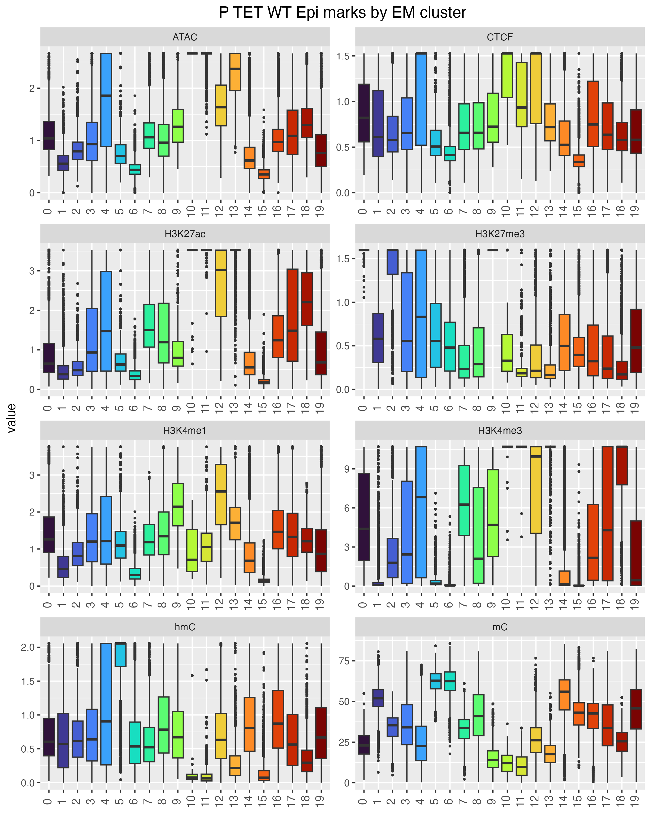
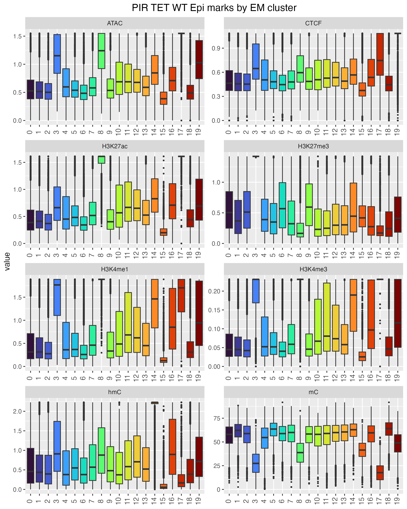
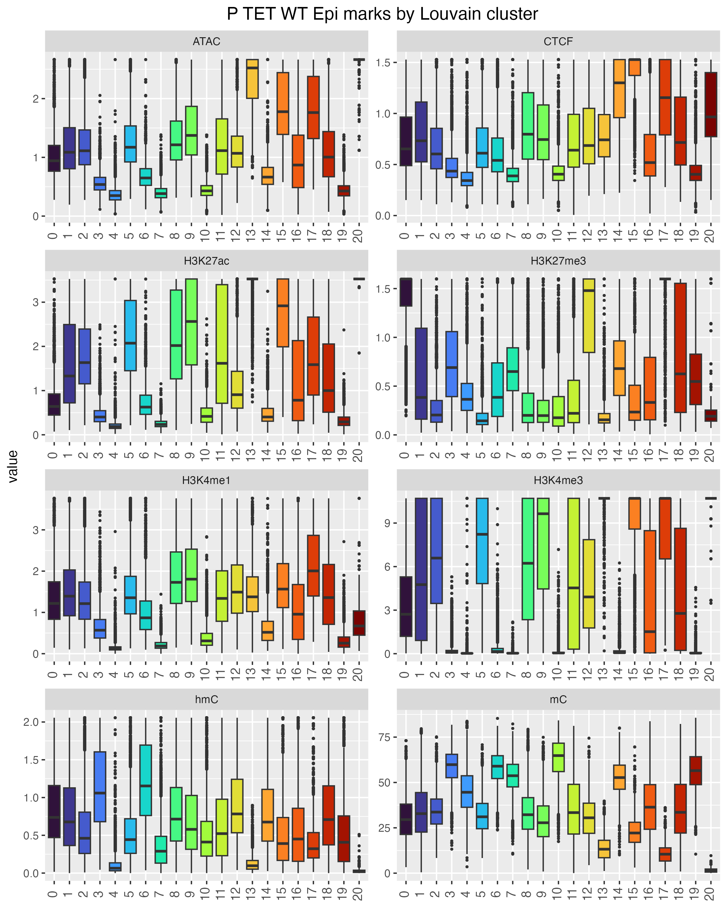
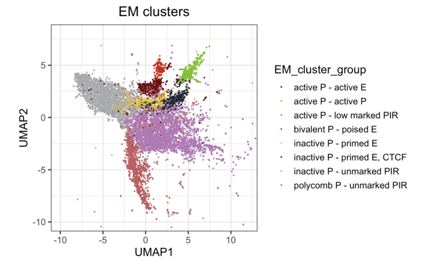
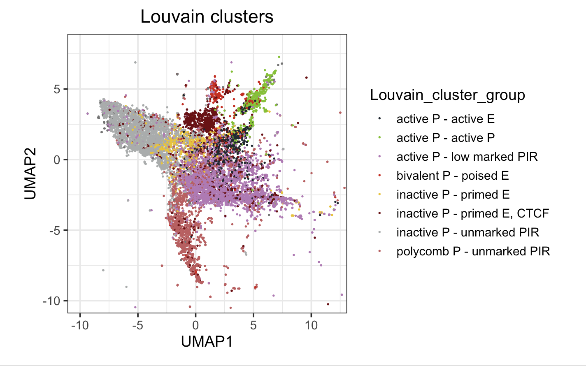

---
hide:
  - footer
---

## UMAP representation

To generate a two dimensional representation of the interaction pair attributes, Uniform Manifold Approximation and Projection for Dimension Reduction (UMAP) was performed. Specifically, centred and scaled linear quantitations of the different sequencing data modalities from the EpiLC TET WT condition were subjected to UMAP using the uwot package with spectral initialisation (Settings: min_dist = 0.01, n_neibors = 2, scale = TRUE). 

## EM Clustering

To produce input for clustering, dimensionality reduction to 15 dimensions was applied to the same quantitations of interaction pair attributes (uwot, min_dist = 0.01, n_neibors = 25, scale = TRUE). Clustering was then performed by Expectation Maximisation for 20 clusters using WEKA (Scheme: weka.clusterers.EM -I 100 -N 20 -X 10 -max -1 -ll-cv 1.0E-6 -ll-iter 1.0E-6 -M 1.0E-6 -K 10 -num-slots 1 -S 100 ). 

## Louvain clustering

As an alternative to EM clustering and to test the robustness of the clustering approach, Louvain clustering after PCA was performed. All values of interaction pair attributes were log normalised and centred by subtracting the average. Levels were also scaled by dividing the centered attribute values by their standard deviation. Then, linear dimensionality reduction was performed by principal component analysis (PCA). The number of dimensions to use for clustering was set to 12 as gauged from the elbow plot (PC vs standard deviation). A KNN graph was constructed based on the euclidean distance in PCA space with edge weights between any two interaction pairs refined based on their shared overlap in their local neighbourhoods (Jaccard similarity) using Seurat functions (FindNeighbors(dims = 1:12), FindClusters(resolution = 1)).  

## Marks for individual clusters

### P marks (EM clusters)

### PIR marks (EM clusters)

### P marks (Louvain clusters)

### PIR marks (Louvain clusters)

## Grouping clusters

While the number of clusters for Louvain clustering was chosen empirically and set to 20, Louvain clustering with the given settings produced 30 clusters. However, 9 clusters had fewer than 600 interaction pairs (the larger clusters having between 14 and 21,000 interaction pairs) and were therefore excluded from further analysis.

We then evaluated chromatin/DNA marks per cluster and grouped them according to presumed biological function.

### EM cluster grouping 

EM activeP lowmarkedPIR: 4, 7, 10, 11, 12, 13, 18, 16
EM pcP unmarkedPIR: 0, 2, 9
EM inactiveP unmarkedPIR: 1, 5, 6, 15
EM inactiveP CTCFprimedE: 19
EM inactiveP primedE: 14
EM bivalentP poisedE:  3
EM activeP activeP: 17
EM activeP activeE: 8

### Louvain cluster grouping 

Louvain activeP lowmarkedPIR: 2, 5, 9, 13, 15, 16
Louvain pcP unmarkedPIR :0, 12, 17, 30
Louvain inactiveP unmarkedPIR: 3, 4, 7, 9, 10, 14, 21, 22, 23, 26, 27, 28, 29
Louvain inactiveP CTCFprimedE: 1, 19
Louvain inactiveP primedE: 20, 6
Louvain bivalentP poisedE:  18, 25
Louvain activeP activeP: 11, 24
Louvain activeP activeE: 8

## EM and Louvain clustering comparison

