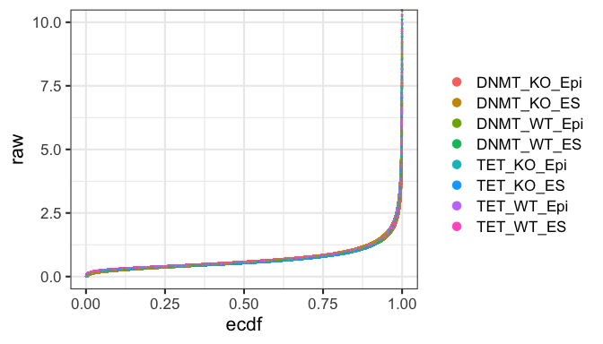

---
hide:
  - footer
---

Global interactions were also represented as a network largely based on the Canvas representation introduced in Chovanec, Collier et al., 2021.  The R igraph package was used to construct an undirected graph in which genomic regions (HindIII fragments) are represented as vertices/nodes and interactions are represented as edges. A combined network was produced using all significant interactions in any of the conditions. This allows for changes in interactions between the different conditions. The network was visualised with a force-directed layout (ForceAtlas2) in Gephi v0.9. This representation pulls highly interacting regions closer together while less interacting regions are kept apart.

The underlying network data can be downloaded [here](../plex_revision/network/network_all_conditions.csv).

Layout parameters were as follows:

To aid visualisation of the levels of different marks, we binned the quantitations into the categories "low", "medium low", "medium high" and "high". As the different marks have different absolute levels and show different signal distributions, we categorised the data via percentiles in their empirical cumulative distribution fuction.

Here is an example illustrating the process: The cumulative distribution of ATAC signal across different conditions is shown. There is a steady increase in signal across large parts of the data prompting us to introduce thresholds at 25, 50 and 75th percentiles.

Here are the thresholds for all marks:

| mark | low | medium low | medium high | high |
|:---|:---:|:---:|:---:|:---:|
| ATAC | < 25 | 25-50 | 50-75| >75 |
| CTCF | <70 | 70-80| 80-90| >90
| H3K27ac | <50 | 50-80 | 80-90 | >90 |
| H3K27me3 | <50 | 50-80 | 80-90 | >90 |
| H3K4me1 | <50 | 50-80 | 80-90 | > 90 |
| H3K4me3 | <80 | 80-90 | 90-95 | >95 |
| hmC | <30 | 30-60 | 60-90 | >90 |
| RNA | <40 | 40-60 | 60-80| >80 |
| mC* | <25 | 25-50 | 50-75 | >75 |

*Note that methylation was categorised according to absolute levels rather than percentiles as it was not measured by an enrichment method and also because the absolute levels and distributions were very different between samples:

